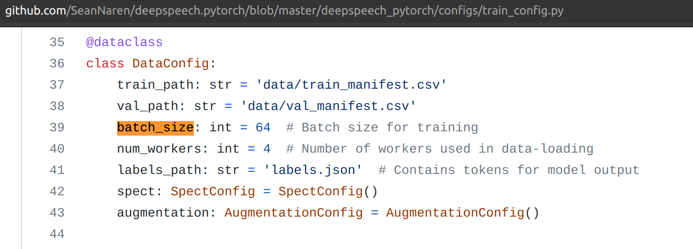
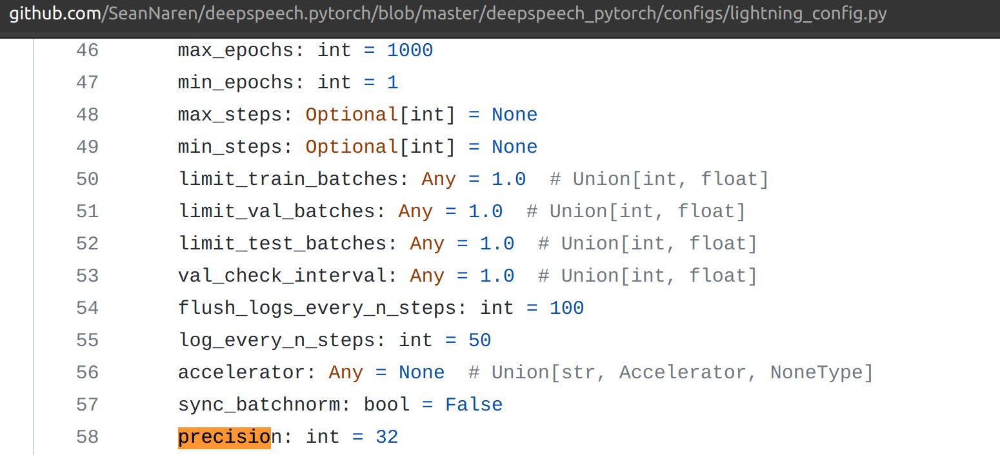

# Profiling DeepSpeech on GPU systems 

- [1. Objective](#1-objective)
- [2. DeepSpeech PyTorch implementation](#2-deepspeech-pytorch-implementation)
- [3. Profiling](#3-profiling)
- [4. Variations](#4-variations)
- [5. Reference](#5-reference)
- [6. Results](#6-results)
  - [6.1. Task 1](#61-task-1)
  - [6.2. Task 2](#62-task-2)
  - [6.3. Task 3](#63-task-3)
  - [6.4. Task 4](#64-task-4)

## 1. Objective

Profiling study of DeepSpeech on P100 as a part of CS 839 Advanced Machine Learning Systems, Spring 2022 with Prof. Shivaram Venkataraman

- Task 1, ML Model Bottlenecks: Given the default training setup in your ML model, which kernels (and correspondingly ML model layers) take the longest fraction of time? What is the GPU utilization for these kernels? You can quantify **utilization using occupancy** for each kernel.  For kernels which take the longest time, what are their bottlenecks? Discuss if it is related to compute / memory using relevant data from profiling.
- Task 2, Role of batch size: **Vary the batch size** from 1 to maximum batch size (in steps) supported by your GPU. What do you find changes in terms of utilization and bottlenecks?
- Task 3, Role of **quantization**: Vary the number of bits used by the model parameters (try FP 16, FP 32, FP 64). What do you find changes in terms of utilization and bottlenecks? You can use a fixed (default) batch size for this part
- Task 4, **Forward vs. Backward pass**: Change the ML model code to only perform the forward pass and compare the utilization / bottlenecks to when both forward and backward passes are performed.

Summarize your observations across all four tasks

## 2. [DeepSpeech PyTorch implementation](https://github.com/SeanNaren/deepspeech.pytorch)

- Default TensorFlow implementation has issues working with recent versions of CUDA
- Pytorch highly recommends installing an Anaconda environment. Also, it simplifies the whole process. Thought of moving from virtualenv to conda
- Docker is optional but not needed
- To get it working on the latest stable branch, this [issue](https://github.com/SeanNaren/deepspeech.pytorch/issues/670) needs fix under ```/home/cc/anaconda3/envs/deepspeech_host_not_docker_env/lib/python3.9/site-packages/hydra_configs/pytorch_lightning/callbacks.py```

```bash

cd /tmp
curl -O https://repo.anaconda.com/archive/Anaconda3-2021.11-Linux-x86_64.sh
bash Anaconda3-2019.03-Linux-x86_64.sh
conda update -n base -c defaults conda
conda create --name deepspech_pytorch_env python=3
conda activate deepspech_pytorch_env
conda activate deepspeech_host_not_docker_env
pip install -r requirements.txt
pip install -e . # Dev install
```

- Install PyTorch for CUDA 11.3 (other available version is 10.2) 
- Installed pre-reqs inside the same environment using the pip commands
- (Optional) Install nvidia-docker from [here](https://docs.nvidia.com/datacenter/cloud-native/container-toolkit/install-guide.html#docker)
- (Optional) Install cuDNN. Full details [here](https://tikoehle.github.io/pytorch_conda_jupyterhub/nvidia_cuDNN.html). Be sure to ```sudo ldconfig``

  ```bash
    sudo cp include/cudnn.h /usr/local/cuda/include
    sudo cp lib64/libcudnn* /usr/local/cuda/lib64
    sudo chmod a+r /usr/local/cuda/include/cudnn.h /usr/local/cuda/lib64/libcudnn*
  ```

- To download only specific dataset for training ```cd data && python librispeech.py --files-to-use="train-clean-100.tar.gz:dev-clean.tar.gz:test-clean.tar.gz:test-other.tar.gz"```
- Start training ```python train.py +configs=librispeech```
- Training working on GPU  
- Nvprof warning 

## 3. Profiling

- [x] **Nvprof**
  - [x] summary: Time spent on each call ```sudo -E env PATH=$PATH nvprof --profile-from-start off --log-file nvprof_summary/bs1-fp32 python train.py +configs=librispeech```
  - [x] metrics: ```sudo -E env PATH=$PATH nvprof --profile-from-start off --kernels "wgrad|sgemm|LSTM|RNN" --metrics achieved_occupancy,ipc,sm_efficiency --log-file metr/bs64-fp32 python train.py +configs=librispeech```. Captured with 5 steps instead of 10, granularity at training_step() because the profiler would not converge within 10minutes
    - Several reports of nvprof being slow especially when memory utilization metrics are enabled. [Example](https://forums.developer.nvidia.com/t/nvprof-is-too-slow/50242/9)
    - Using only top 2 kernels that attribute to 70% of execution time: ```sudo -E env PATH=$PATH nvprof --profile-from-start off --kernels "maxwell_fp16_sgemm_fp16_128x32_nn|maxwell_fp16_sgemm_fp16_32x128_nt" --metrics achieved_occupancy,ipc,sm_efficiency --log-file metr/bs64-fp32-top2only python train.py +configs=librispeech```
    - Only profile first invocation of all kernels: ```sudo -E env PATH=$PATH nvprof --profile-from-start off --kernels ":::1" --metrics achieved_occupancy,ipc,sm_efficiency --log-file first_invocation_final/bs64-fp32python train.py +configs=librispeech```
    - Even this does not converge after 60+ minutes. [Screenshot](images/stuck.jpg) ```sudo -E env PATH=$PATH nvprof --profile-from-start off --kernels ":::1" --metrics dram_utilization --log-file first_invocation_final_dram/bs64-fp64 python train.py +configs=librispeech```
  - [x] trace: Kernel launch parameter ```sudo -E env PATH=$PATH nvprof --profile-from-start off --print-gpu-trace --log-file nvprof_trace/bs1-fp32 python train.py +configs=librispeech```. Captured with 5 steps instead of 10
  - nvvp: Images use analysis metrics only on top 5 kernels
    - Focussed profiling on ```training_step``` (in model.py) or ```train.fit()``` (in training.py) cudaStart/Stop -> This works. About 25% savings in nvvp dumps and faster runtime
- [x] **cProfile**: Call trace esp when using framework where trainer.fit() was hiding all steps. Useful to track down epoch/steps ```python -m cProfile -s cumtime train.py +configs=librispeech```
  - We also noticed the effect of reducing/increasing number of steps in the cprofile log calls
- [x] **PyTorch**: Simple -> Forward vs Backward time allocation and split up of each stage in training
- [x] **PyTorchProfiler**(): ```sudo -E env PATH=$PATH python train.py +configs=librispeech```
  - Instrumentation for Pytorch Profiler:

    ```python
    profiler = PyTorchProfiler(dirpath = "/home/cc/data", filename = "./bs-16", export_to_chrome = True, {"profile_memory":True})
    ```
  - The default schedule requires 5 steps to work properly otherwise raises segfault [Source](https://github.com/PyTorchLightning/pytorch-lightning/blob/e15a66412cc220fa241ec7cbb64b339a2f124761/pytorch_lightning/profiler/pytorch.py#L417)
  - Nothing seems to slow this profiler down, When I changed the batch size it sped up at smaller batches. I think this is a sampling based profiler. While nvprof instruments every CUDA API call. Which is why it is so slow because we have millions of those calls
  - [Pytorch profiler recipes](https://pytorch.org/tutorials/recipes/recipes/profiler_recipe.html)
  - [Lightning Profiler docs](https://pytorch-lightning.readthedocs.io/en/stable/advanced/profiler.html)
  - [Torch profiler docs](https://pytorch.org/docs/stable/profiler.html)
  - 
  - PyTorch Profiler gives forwards vs backward information in Trace

**TBD**:

- DLProf https://docs.nvidia.com/deeplearning/frameworks/dlprof-user-guide/

## 4. Variations

- Batch size: 1-256 
  - Maximum supported batch size on P100 [Source](images/maxbs.png)
- Precision: 16/32/64 
  - [Pytorch Lightning Docs](https://pytorch-lightning.readthedocs.io/en/latest/advanced/mixed_precision.html)
- Use inference to separate forward from backward
  - ```sudo -E env PATH=$PATH python test.py model.model_path=librispeech_pretrained_v3.ckpt test_path=data/libri_test_clean_manifest.json```

## 5. Reference

- To select a specific GPU, use ```export CUDA_VISIBLE_DEVICES=1```
- ```sudo -E env PATH=$PATH``` to pass environment variables under sudo for NVProf
- Run this to avoid conda auto-activate ```conda config --set auto_activate_base false```
- Get torch version inside python ```import torch print(torch.__version__)```
- You can kill GPU processes by using the PID from nvidia-smi
- Focussed profiling on CUDA [reference](https://dev-discuss.pytorch.org/t/using-nsight-systems-to-profile-gpu-workload/59), [2](https://gist.github.com/mcarilli/213a4e698e4a0ae2234ddee56f4f3f95)
- How to pass kwargs (useful for pytorch lightning profiler):
  - [Dealing with kwargs on python](https://www.digitalocean.com/community/tutorials/how-to-use-args-and-kwargs-in-python-3)
  - [Source code](https://github.com/PyTorchLightning/pytorch-lightning/blob/master/pytorch_lightning/profiler/pytorch.py#L330)
- Handy tips on using nvprof on ML profiling my mcarilli's [gist](https://gist.github.com/mcarilli/213a4e698e4a0ae2234ddee56f4f3f95)
- [Dealing with multiple kernel names on nvprof](https://forums.developer.nvidia.com/t/nvprof-to-profile-multiple-kernel-names/72289)
- [Exporting nvprof output to file](https://forums.developer.nvidia.com/t/nvprof-export-to-txt/168955/8)
- Note that profiling of metric and event is only supported up to the Volta architecture through Nvprof. The Turing architecture Nvprof only supports tracing functionality. Use Nsight Compute instead to show profiling metrics on Turing.
- Kernel replay is required when you are collecting a lot of metrics. This is because only a few metrics can be collected at a time by the profiler. The problem of course is that it means the kernel has to be replayed many times to finish data collection. So this will finish but it will take a long time. Things you can do to speed it up: collect fewer metrics (specify the metrics you want one at a time) or run fewer iterations (this means fewer kernels).
- Analysis metrics: By default nvprof doesn't collect any metrics. So while the visual profiler can show the timeline you can't drill down into the metrics for each kernel. You can collect metrics by passing `--analysis-metrics`
- nvtx annotations were not possible since lightning library abstracts away most of the steps


Some helpful links that describe nvprof profiler include
https://github.com/mit-satori/getting-started/blob/master/tutorial-examples/nvprof-profiling/Satori_NVProf_Intro.pdf 
https://developer.nvidia.com/blog/cuda-pro-tip-nvprof-your-handy-universal-gpu-profiler/
https://gist.github.com/sonots/5abc0bccec2010ac69ff74788b265086

You are also welcome to use other profiling tools such as PyProf https://github.com/NVIDIA/PyProf and the PyTorch profiler https://pytorch.org/blog/introducing-pytorch-profiler-the-new-and-improved-performance-tool/

GPU architecture details can be found at
https://images.nvidia.com/content/pdf/tesla/whitepaper/pascal-architecture-whitepaper.pdf
Tasks

## 6. Results

To be updated after analyzing logs

### 6.1. Task 1

1. ```sudo -E env PATH=$PATH nvprof --profile-from-start off --log-file Task1/nvprof_summary python train.py +configs=librispeech```
2. ```sudo -E env PATH=$PATH nvprof --profile-from-start off --kernels "maxwell_fp16_sgemm_fp16_128x32_nn:maxwell_fp16_sgemm_fp16_32x128_nt:maxwell_fp16_sgemm_fp16_32x128_nn:wgrad_alg0_engine:vectorized_elementwise_kernel:maxwell_fp16_sgemm_fp16_64x64_nn:elemWiseRNNcell:LSTM_elementWise_bp1:gemmk1_kernel:CUDA memcpy DtoD:CUDA memcpy HtoD:CUDA memcpy DtoH" --log-file Task1/nvprof_metrics --metrics achieved_occupancy,sm_efficiency,cf_executed,ipc python train.py +configs=librispeech```

--kernels "maxwell_fp16_sgemm_fp16_128x32_nn:maxwell_fp16_sgemm_fp16_32x128_nt:maxwell_fp16_sgemm_fp16_32x128_nn:wgrad_alg0_engine:vectorized_elementwise_kernel:maxwell_fp16_sgemm_fp16_64x64_nn:elemWiseRNNcell:LSTM_elementWise_bp1:gemmk1_kernel:memcpy"

### 6.2. Task 2

- On batch size of 128 with P100, we get the following issue: ```RuntimeError: CUDA out of memory. Tried to allocate 1.29 GiB (GPU 0; 15.90 GiB total capacity; 13.46 GiB already allocated; 979.81 MiB free; 13.94 GiB reserved in total by PyTorch) If reserved memory is >> allocated memory try setting max_split_size_mb to avoid fragmentation. See documentation for Memory Management and PYTORCH_CUDA_ALLOC_CONF```
- From this, we infer that P100 cannot handle batch sizes greater than 64 on DeepSpeech model

### 6.3. Task 3

### 6.4. Task 4