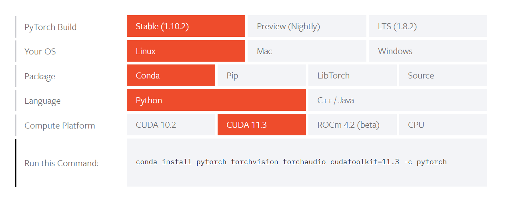

# DeepSpeech

## DeepSpeech PyTorch implementation

- Pytorch highly recommends installing an Anaconda environment. Also, it simplifies the whole process. Thought of moving from virtualenv to conda

```bash

cd /tmp
curl -O https://repo.anaconda.com/archive/Anaconda3-2021.11-Linux-x86_64.sh
bash Anaconda3-2019.03-Linux-x86_64.sh
conda update -n base -c defaults conda
conda create --name deepspech_pytorch_env python=3
conda activate deepspech_pytorch_env
```

- Install PyTorch for CUDA 11.3 (other available version is 10.2) 
- Installed pre-reqs inside the same environment for deepspech_pytorch_env
- Install nvidia-docker from [here](https://docs.nvidia.com/datacenter/cloud-native/container-toolkit/install-guide.html#docker)
- Install cuDNN. Full details [here](https://tikoehle.github.io/pytorch_conda_jupyterhub/nvidia_cuDNN.html)

```bash
   sudo cp include/cudnn.h /usr/local/cuda/include
   sudo cp lib64/libcudnn* /usr/local/cuda/lib64
   sudo chmod a+r /usr/local/cuda/include/cudnn.h /usr/local/cuda/lib64/libcudnn*
```

- To download only specific dataset for training ```cd data && python librispeech.py --files-to-use=train-clean-100.tar.gz```
